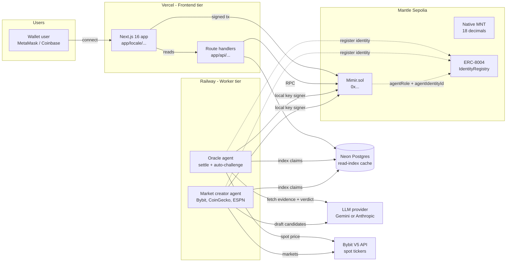
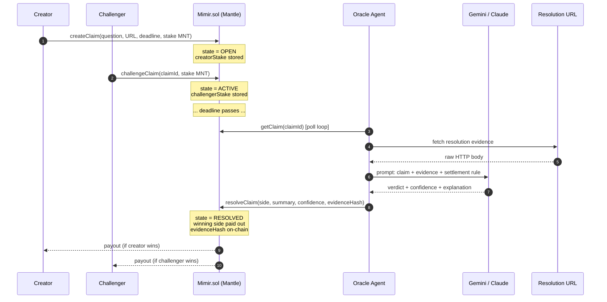
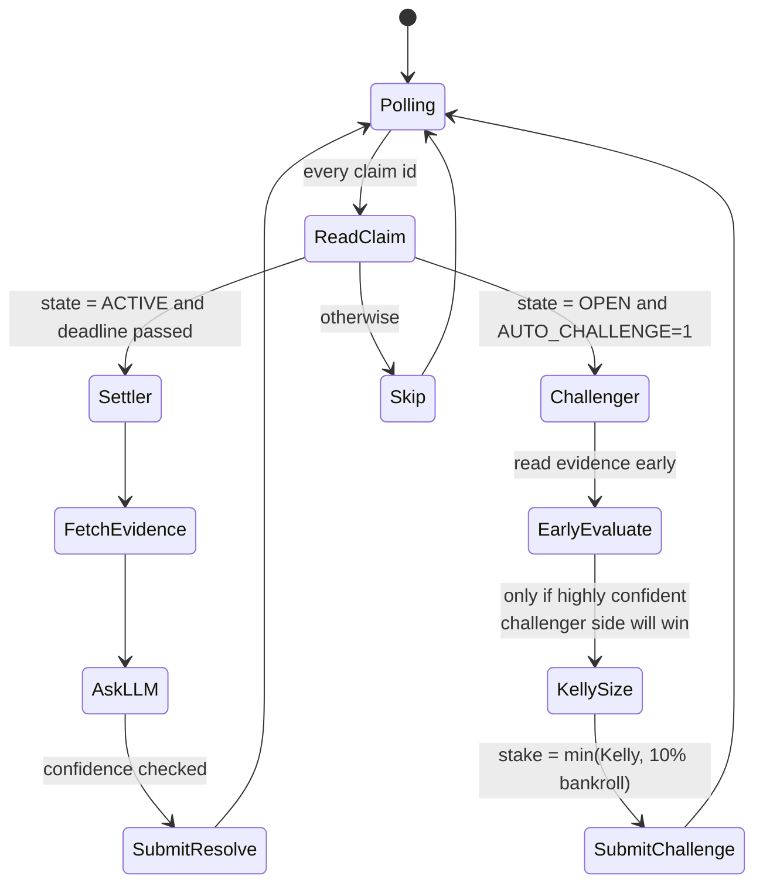
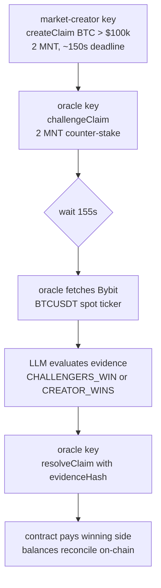
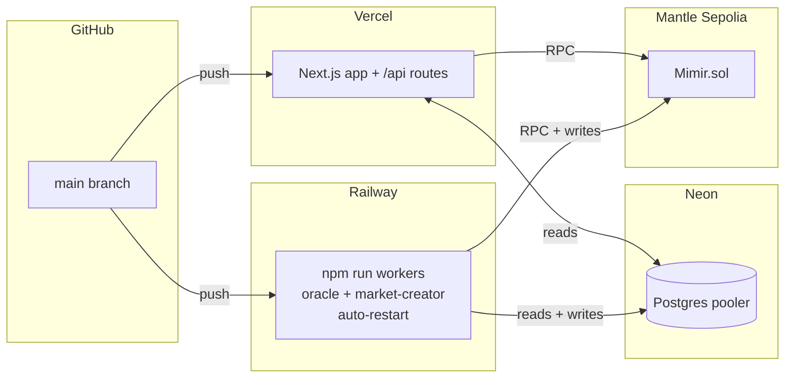

# Mimir

**An AI-settled claim market on [Mantle](https://mantle.xyz).**

> *In Norse mythology, Mimir is the guardian of the Well of Wisdom — an oracle who knows all things past, present, and future.*

Mimir is a peer-to-peer market for public claims about future outcomes. Two parties stake native **MNT** on opposite sides of a question; when the deadline passes, an off-chain AI oracle reads the agreed-upon evidence source, evaluates the verdict, and settles the payout on-chain. Every step — staking, challenging, resolution, payout — happens in MNT with the evidence hash committed to contract storage as a verifiable reasoning trace.

The agents that run Mimir are first-class economic actors. They hold MNT, place bets sized by the Kelly criterion, open and settle markets, and accumulate on-chain reputation. Their identities are registered against the Mantle ERC-8004 IdentityRegistry, making every win and loss attributable to a specific autonomous agent NFT.

---

## Table of contents

- [What it does](#what-it-does)
- [Architecture](#architecture)
- [The settlement lifecycle](#the-settlement-lifecycle)
- [Agents as economic actors](#agents-as-economic-actors)
- [ERC-8004 agent identity](#erc-8004-agent-identity)
- [Tech stack](#tech-stack)
- [Repository layout](#repository-layout)
- [Local setup](#local-setup)
- [End-to-end demo](#end-to-end-demo)
- [Deploying to Mantle](#deploying-to-mantle)
- [Configuration reference](#configuration-reference)
- [Scripts](#scripts)
- [Design principles](#design-principles)

---

## What it does

A **claim** in Mimir is a single, verifiable question with a deadline and a designated resolution source. For example:

> *"Will the Bybit BTC/USDT spot price close above $100,000 on 2026-06-15?"*

Anyone can create a claim, stake MNT on one side, and publish it. Another party (or the autonomous market-creator agent) can **challenge** by staking MNT on the opposite side. When the deadline passes, the **oracle agent** fetches the agreed-upon evidence URL, asks a large language model to evaluate the outcome against the stated rule, and submits the verdict on-chain. The smart contract then atomically pays out the winning side.

There are no judges, no committees, no manual disputes. The product surfaces are:

| Page                                 | Purpose                                                                            |
| ------------------------------------ | ---------------------------------------------------------------------------------- |
| `/`                                  | Marketing surface — what Mimir is, live stats, recent settlements                  |
| `/explorer`                          | Claim feed with Open / AI signals / Closed tabs and category + stake filters       |
| `/vs/[id]`                           | Claim detail — pool sizes, challengers, settlement receipt with confidence tier     |
| `/vs/create`                         | Author flow — claim drafting with AI-assisted resolution metadata                  |
| `/dashboard`                         | Per-wallet view — your claims, your payouts, your W/L record                       |
| `/stats`                             | Real-time on-chain analytics: total volume, accuracy %, refund rate, agent vault   |
| `/agents`                            | Live activity log for the oracle + market-creator with their ERC-8004 reputation   |
| `/docs`                              | Long-form architecture + how-it-works writeup with diagrams                        |
| `/emerging-narratives`               | Daily-curated "challenge-ready" opportunities (human-lite curation)                |

---

## Architecture



The diagram shows three independent runtime tiers:

1. **Frontend tier (Vercel)** — Next.js App Router with API routes. Pure read paths talk to Mantle RPC directly; writes are user-signed via wagmi/viem.
2. **Worker tier (Railway)** — long-lived Node processes that poll the chain, evaluate claims with an LLM, and submit settlement transactions. Each agent owns a local EVM private key.
3. **Data tier (Neon Postgres)** — a denormalised read-index of the on-chain state. Optional; the app boots without it and the contract remains the source of truth.

---

## The settlement lifecycle



Several details matter for trust:

- **`evidenceHash`** is `keccak256(raw evidence)` and is committed to contract storage. Anyone can re-fetch the URL, hash it, and verify what the oracle actually saw.
- **`confidence`** is exposed on-chain. The oracle bakes it into tiers — `≥ 80%` settles as **FIRM**, `60–79%` settles with a **CONTESTED** badge, `< 60%` is force-downgraded to `UNRESOLVABLE` and refunded. The Settlement Receipt UI surfaces the tier explicitly.
- **`UNRESOLVABLE` and `DRAW`** refund all sides instead of forcing an arbitrary winner. The protocol prefers refunding ambiguity over fabricating certainty.
- **Challenge lock window.** `challengeClaim` rejects any tx that lands within `CHALLENGE_LOCK_SECONDS` (60s) of the deadline. Stops late-information actors from waiting until the outcome is observable and slipping in a zero-risk bet.
- **Only the configured `oracle` address** can call `resolveClaim`. That address is the oracle agent's wallet — no one else can re-route it.

---

## Agents as economic actors

Two background agents run continuously. Each owns a local EVM private key and signs transactions directly through viem — no custodial layer, no KMS.

### Oracle agent (`agents/oracle/index.ts`)

A poll loop every 60 seconds. Two roles:



- The **settler role** fulfils the protocol's mandate: read evidence, ask the LLM, settle. Pure on-chain side-effect.
- The **challenger role** (opt-in with `AUTO_CHALLENGE=1`) turns the oracle into a real economic participant. It uses the [Kelly criterion](https://en.wikipedia.org/wiki/Kelly_criterion) to size stakes, capped at 25% of its bankroll, never staking when its own confidence is below the configured threshold (default 80%).

### Market-creator agent (`agents/market-creator/index.ts`)

Runs every 6 hours. Fetches public data feeds (Bybit V5 spot tickers, CoinGecko, ESPN, OpenWeather), asks the LLM to draft 1–5 verifiable claim candidates, scores each candidate for quality, and creates the highest-scoring ones on-chain — staking the creator side from its own balance. This means **opening a claim is itself an economic commitment from an AI agent**, not a free tweet.

The agent treats curation as the scarce resource. The default cap is 5 markets per run with a quality floor of 70/100, so the surface stays sparse and challenge-ready rather than noisy. Bybit is the primary settlement source for price-prediction markets because its public V5 spot ticker endpoint returns a single deterministic price the oracle can re-fetch and hash.

---

## ERC-8004 agent identity

Mimir treats AI agents as first-class economic citizens. To make their on-chain track record portable and queryable beyond Mimir itself, each agent is registered against [Mantle's ERC-8004 IdentityRegistry](https://eips.ethereum.org/EIPS/eip-8004):

1. `scripts/register-agents.ts` mints an identity NFT for the oracle and market-creator addresses through the IdentityRegistry contract.
2. The returned `agentId` is mirrored into Mimir.sol via `registerAgent(wallet, role, identityId)`. The contract emits an `AgentRegistered` event so off-chain indexers can attribute every subsequent settlement to a specific identity NFT.
3. The contract's `wins` / `losses` mappings stay the canonical Mimir-internal record; the ERC-8004 IdentityRegistry is the external, protocol-agnostic identity layer that other AI services can consume.

The result is a stack where any third party can answer "*which AI agents have a track record on Mantle, what is their MNT-denominated PnL, and what is their settlement accuracy?*" without trusting any single registry.

---

## Tech stack

| Layer              | Choice                                                                            | Why                                                                                                              |
| ------------------ | --------------------------------------------------------------------------------- | ---------------------------------------------------------------------------------------------------------------- |
| Frontend           | Next.js 16 (App Router) + React 18 + TypeScript + Tailwind CSS + Framer Motion    | App Router for streaming + parallel route handlers; Framer Motion for the live deadline UI                       |
| Wallet             | wagmi v3 + viem v2                                                                | First-class Mantle chain support, auto chain-switch on connect                                                   |
| Smart contract     | Solidity ^0.8.20, compiled with solc 0.8.28 `viaIR`                               | `Mimir.sol` is dependency-free. `viaIR` is required because the create flow exceeds stack-depth without it       |
| Blockchain         | Mantle Sepolia (chain ID `5003`) — or Mantle mainnet (`5000`) via env flag        | EVM-compatible, native MNT gas, mature tooling                                                                   |
| Native currency    | MNT (18 decimals)                                                                 | `msg.value` accepts MNT directly; stakes settle without ERC-20 approval rounds                                   |
| Agent identity     | ERC-8004 IdentityRegistry on Mantle                                               | Portable, protocol-agnostic record of each AI agent's track record                                                |
| Agent signer       | Local EVM private keys (viem)                                                     | Each agent owns its keys; no custodial dependency                                                                |
| Price feed         | Bybit V5 spot tickers (`/v5/market/tickers?category=spot&symbol=…`)               | Public, auth-free, single canonical price per symbol                                                              |
| LLM (pluggable)    | Google Gemini 2.5 Flash *or* Anthropic Claude Sonnet 4.6                          | `lib/llm.ts` auto-selects whichever key is present; force a choice with `LLM_PROVIDER`                            |
| Messaging          | XMTP Browser SDK v7 (`@xmtp/browser-sdk`)                                         | Optional E2E-encrypted chat between creator and challenger before/after settlement                               |
| Database           | Neon Postgres via `@neondatabase/serverless`                                      | Serverless-friendly driver, works on both Vercel functions and Railway long-running workers                      |
| i18n               | next-intl (English)                                                               | Locale-prefixed routing, runtime message loading                                                                  |
| Frontend hosting   | Vercel                                                                            | Native Next.js, 30s function timeout for /api routes                                                              |
| Worker hosting     | Railway                                                                           | Long-lived processes; `npm run workers` runs the oracle + market-creator concurrently with auto-restart           |

---

## Repository layout

```
mimir-mantle/
├── app/
│   ├── [locale]/
│   │   ├── dashboard/                    # personal W/L view
│   │   ├── emerging-narratives/          # daily-curated challenge ideas
│   │   ├── explorer/                     # market discovery feed
│   │   ├── stats/page.tsx                # on-chain analytics
│   │   ├── vs/                           # claim detail + create flows
│   │   ├── agents/                       # oracle + market-creator activity + ERC-8004 reputation
│   │   ├── messages/                     # XMTP inbox
│   │   ├── docs/                         # long-form architecture writeup
│   │   ├── layout.tsx                    # i18n root layout
│   │   └── page.tsx                      # landing page
│   └── api/
│       ├── challenge-opportunities/      # curated feed
│       ├── claim-draft/                  # LLM-assisted draft endpoint
│       ├── claim-moderation/             # safety filter
│       ├── cron/                         # scheduled tasks
│       ├── network-status/               # Mantle RPC health
│       └── vs/                           # feed, detail, sync routes
├── agents/
│   ├── oracle/index.ts                   # settler + Kelly auto-challenger
│   └── market-creator/index.ts           # autonomous market author (Bybit, CoinGecko, ESPN)
├── contracts/
│   └── Mimir.sol                         # the only contract; deployed on Mantle
├── lib/
│   ├── mantle.ts                         # chain config + viem clients + MNT helpers
│   ├── agent-signer.ts                   # local-key signer for the worker agents
│   ├── sources/bybit.ts                  # Bybit V5 spot ticker helpers
│   ├── contract.ts                       # high-level TypeScript contract client
│   ├── db.ts                             # Neon read-index
│   ├── llm.ts                            # provider-agnostic LLM call
│   ├── mimir-abi.ts                      # generated ABI + state constants
│   ├── wagmi-config.ts                   # Mantle-only wagmi config
│   ├── wallet.tsx                        # frontend wallet context
│   └── server/                           # server-only modules (DB writers, etc.)
├── components/
│   ├── Header.tsx, Footer.tsx, ...       # layout
│   └── ... ~80 product components
├── scripts/
│   ├── compile.ts                        # solc 0.8.28 → artifacts/Mimir.bin + .abi.json
│   ├── deploy.ts                         # deploy Mimir.sol to Mantle (Sepolia by default)
│   ├── generate-agent-wallets.ts         # mint fresh oracle + market-creator keys
│   ├── register-agents.ts                # ERC-8004 mint + Mimir.registerAgent mirror
│   ├── check-agent-balances.ts           # read on-chain MNT balances
│   ├── check-claim.ts                    # inspect any claim
│   ├── demo-full-cycle.ts                # full create → challenge → settle in ~3 min
│   ├── seed-claims.ts                    # bulk-seed demo markets
│   ├── test-llm.ts                       # sanity-check the LLM provider
│   └── warm-vs-index.ts                  # rebuild Neon cache from on-chain
├── tests/node/                           # Node-native smoke tests (no jest)
├── messages/                             # next-intl translations
├── public/                               # static assets
├── artifacts/                            # compiled Mimir.bin + Mimir.abi.json
├── vercel.json                           # Vercel deploy config
├── railway.json                          # Railway worker config
└── package.json
```

---

## Local setup

### Prerequisites

- Node.js 20+
- An LLM key — either **Google Gemini** ([aistudio.google.com/apikey](https://aistudio.google.com/apikey)) or **Anthropic Claude** ([console.anthropic.com](https://console.anthropic.com))
- Testnet MNT for the deployer + agents (one or more of):
    - [Mantle official faucet](https://faucet.sepolia.mantle.xyz)
    - [QuickNode Mantle Sepolia faucet](https://faucet.quicknode.com/mantle/sepolia)
    - [Chainlink faucet](https://faucets.chain.link/mantle-sepolia)
- Optional: a Neon account at [console.neon.tech](https://console.neon.tech) for the read-index

### One-time bootstrap

```bash
git clone https://github.com/<you>/mimir-mantle
cd mimir-mantle
npm install
cp .env.example .env.local
# Open .env.local and add at minimum:
#   GEMINI_API_KEY=... (or ANTHROPIC_API_KEY=...)
```

### Provision the agent wallets

```bash
# Generates fresh oracle + market-creator private keys and writes them
# (ORACLE_PRIVATE_KEY, ORACLE_ADDRESS, MARKET_CREATOR_*) into .env.local.
npm run agent:wallets
```

Then **fund both addresses** with testnet MNT from any of the faucets above. The deployer (which can be the same as the market-creator key, or a one-shot key in `DEPLOYER_PRIVATE_KEY`) needs ~1 MNT minimum.

### Compile and deploy the contract

```bash
npm run compile:contract       # solc 0.8.28 viaIR → artifacts/Mimir.bin + Mimir.abi.json
npm run deploy:contract        # deploys to Mantle Sepolia, writes NEXT_PUBLIC_CONTRACT_ADDRESS
```

The deploy script also `transferOwnership(MARKET_CREATOR_ADDRESS)` so the market-creator key alone is sufficient to register agents and bootstrap the protocol.

### Register agents against ERC-8004

```bash
npm run agent:register         # mints identity NFTs + Mimir.registerAgent(...)
```

If the Mantle ERC-8004 IdentityRegistry isn't deployed on your chosen testnet yet, the script still writes the role mapping into Mimir.sol so off-chain consumers can attribute settlement events — just with `agentIdentityId = 0`.

### Run the app

```bash
npm run dev                    # http://localhost:3000
```

In a separate terminal, run the agents:

```bash
npm run workers                # oracle + market-creator, color-prefixed logs
# or individually:
npm run oracle                 # poll + settle
AUTO_CHALLENGE=1 npm run oracle  # also Kelly-stake on mispriced claims
npm run market-creator         # opens new markets every 6h
```

---

## End-to-end demo

There is a single script that exercises the full economic loop in ~3 minutes:

```bash
npm run demo
```

What it does:



The script prints the Mantle explorer URL for every transaction so you can verify each step on chain.

---

## Deploying to Mantle

Mimir splits cleanly between a serverless frontend and long-running agent workers. The two-platform split lets each piece run where it fits — Vercel functions time out before the oracle's poll cycle completes, and Railway is awkward for static Next.js.



### Vercel — frontend

1. Import the repo at [vercel.com/new](https://vercel.com/new). Framework auto-detects as Next.js.
2. **Settings → Environment Variables**, add at minimum:
   - `NEXT_PUBLIC_CONTRACT_ADDRESS`
   - `NEXT_PUBLIC_MANTLE_RPC` (optional override; the default public RPC is fine)
   - `DATABASE_URL` (Neon pooler URL, optional)
   - `GEMINI_API_KEY` or `ANTHROPIC_API_KEY` (used by the moderation + draft API routes)

### Railway — workers

1. New Project → Deploy from GitHub → pick this repo.
2. Set the start command to `npm run workers`.
3. Mirror the same env vars as Vercel, plus:
   - `ORACLE_PRIVATE_KEY`, `ORACLE_ADDRESS`
   - `MARKET_CREATOR_PRIVATE_KEY`, `MARKET_CREATOR_ADDRESS`
   - `AUTO_CHALLENGE=1` if you want the oracle to also place economic challenges
4. The `railway.json` in this repo already wires the two workers with `concurrently` so a single Railway service runs both.

---

## Configuration reference

Every variable is documented inline in `.env.example`. The non-obvious ones:

| Variable                              | Purpose                                                                  |
| ------------------------------------- | ------------------------------------------------------------------------ |
| `NEXT_PUBLIC_CONTRACT_ADDRESS`        | `Mimir.sol` deployment address. Written automatically by `deploy.ts`.   |
| `NEXT_PUBLIC_MANTLE_MAINNET=1`        | Targets Mantle mainnet (chain 5000) instead of Sepolia.                  |
| `NEXT_PUBLIC_MANTLE_RPC`              | Override the default public RPC.                                         |
| `ERC8004_IDENTITY_REGISTRY`           | Mantle ERC-8004 IdentityRegistry address. Optional — register-agents.ts skips the mint step if unset. |
| `ORACLE_PRIVATE_KEY` / `ORACLE_ADDRESS` | Oracle agent's signing key + matching address.                          |
| `MARKET_CREATOR_PRIVATE_KEY` / `MARKET_CREATOR_ADDRESS` | Market-creator agent's signing key + matching address. |
| `DEPLOYER_PRIVATE_KEY`                | One-shot deployer for `deploy.ts`. Can reuse the market-creator key.    |
| `AUTO_CHALLENGE`                      | `1` to enable the oracle's Kelly auto-challenger.                        |
| `CHALLENGE_STAKE_MNT`                 | Stake per auto-challenge in MNT (default 2).                             |
| `CHALLENGE_CONFIDENCE`                | Minimum confidence % to auto-stake (default 80).                         |
| `LLM_PROVIDER`                        | `gemini` or `anthropic`. Auto-detected if unset.                         |
| `ORACLE_LLM_MODEL`                    | Override the default model (`gemini-2.5-flash`).                         |
| `BYBIT_API_BASE`                      | Override the Bybit API host (default `https://api.bybit.com`).           |
| `DATABASE_URL`                        | Neon pooler URL for the optional read-index.                             |

---

## Scripts

| Command                              | What it does                                                         |
| ------------------------------------ | -------------------------------------------------------------------- |
| `npm run dev`                        | Next.js dev server                                                   |
| `npm run build`                      | Production build                                                     |
| `npm run compile:contract`           | solc 0.8.28 viaIR → `artifacts/Mimir.bin` + `Mimir.abi.json`        |
| `npm run deploy:contract`            | Deploy `Mimir.sol` to Mantle, write `NEXT_PUBLIC_CONTRACT_ADDRESS`   |
| `npm run agent:wallets`              | Generate oracle + market-creator private keys                        |
| `npm run agent:register`             | Mint ERC-8004 identities + call `Mimir.registerAgent`                |
| `npm run oracle`                     | Run the oracle settler                                               |
| `npm run oracle:challenge`           | Same as `oracle` but with `AUTO_CHALLENGE=1`                         |
| `npm run market-creator`             | Run the market-creator agent                                         |
| `npm run workers`                    | Run both agents concurrently                                         |
| `npm run demo`                       | Full create → challenge → settle in ~3 minutes                       |
| `npm run seed`                       | Bulk-seed demo markets                                               |
| `npm run test:smoke`                 | Node-native smoke tests                                              |
| `npm run warm:vs-index`              | Rebuild Neon read-index from on-chain                                |

---

## Design principles

- **Contract is the source of truth.** Every claim, stake, and verdict lives on Mantle. Neon is a cache; the app boots without it.
- **Refund ambiguity, don't fabricate certainty.** Low-confidence LLM verdicts force the contract to refund instead of guessing a winner.
- **Agents own their keys.** No custodial layer, no KMS, no off-chain trust assumption beyond "the LLM read the URL we said it would read."
- **Evidence is verifiable.** Every settlement commits `keccak256(evidence)` to chain. Anyone can re-fetch and re-hash to confirm.
- **Opening a market costs MNT.** The market-creator stakes from its own balance; markets aren't free tweets.
- **Sparse beats noisy.** Default cap is 5 new markets per 6 hours, quality floor 70/100.
- **One protocol-agnostic identity per agent.** ERC-8004 registers the agent once; every Mimir win/loss is attributable to that identity NFT from any other protocol that reads the registry.

---

## License

AGPL-3.0-or-later. See [LICENSE](LICENSE).
